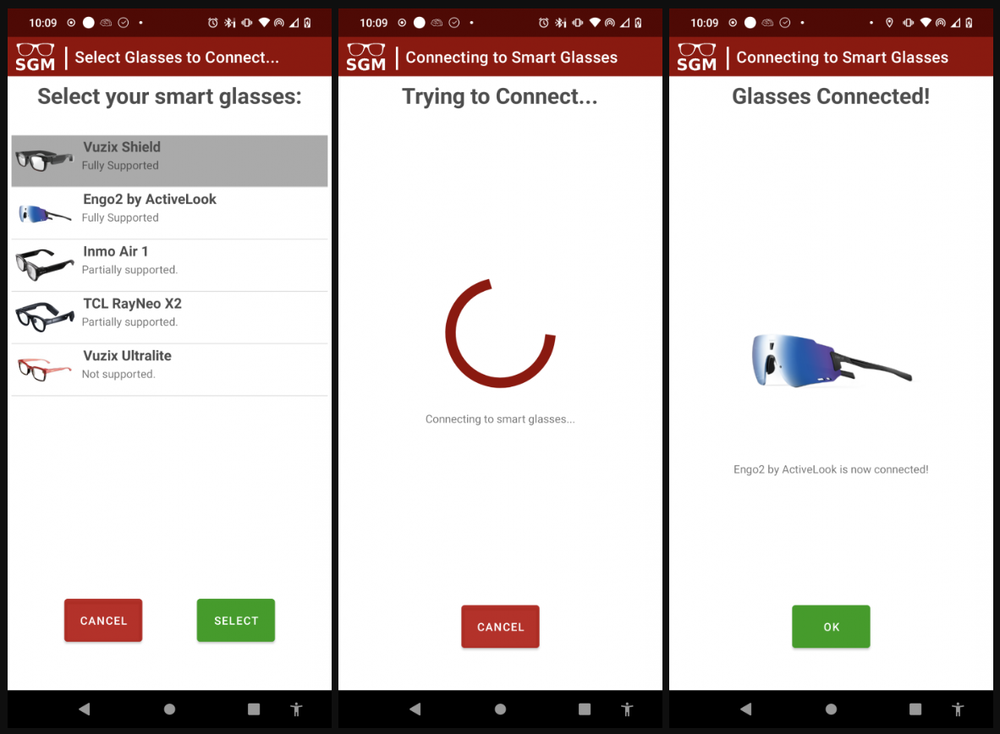

# SmartGlassesManager

    <b>The most important app for smart glasses.</b>

    

### Users
The SmartGlassesManager gives you access to a huge number of applications for your smart glasses. This includes search engine, language translation, ChatGPT conversations, note-taking, intelligent assistants, etc. applications not available anywhere else.

### Developers
Building apps that run on a smart phone and stream data to smart glasses is hard, but it’s how today’s lightweight smart glasses work. We handle the connection, UI, data streaming, and transcription, allowing you to rapidly develop smart glasses applications that run on any pair of smart glasses.

### Industry
Your smart glasses won’t see massive consumer adoption if third party developers can’t make awesome apps for your hardware. The SmartGlassesManager is a middleware which already supports many apps and makes it easy for developers to build more. That means, if you add support to your hardware for a single application – the SmartGlassesManager – your glasses will instantly support a plethora of consumer-facing applications.

    

### How?

The Smart Glasses Manager is an app that solves some major problems in the smart glasses industry.

The problems:

- it's hard to write smart glasses applications
- we want multiple different apps to run on our phone, and all of them to display on our smart glasses.
- only 1 app can connect to the glasses at any 1 time
- something has to manage connecting to the glasses, the UI, which app is displaying, voice commands, streaming data back and forth, etc.
 
The solution:

The Smart Glasses Manager is that 1 app. It connects to the glasses, handles the UI, and displays information from various third-party apps directly on your smart glasses. This enables developers to write 1 app that will automagically work on any pair of smart glasses that the SmartGlasssesManager supports.

This project is being built by [TeamOpenSmartGlasses](https://teamopensmartglasses.com).

## Architecture

1. Android native smart phone server (WIS fork)
2. A native Android library that third parties app call to send data to smart glasses through the ASP server
3. Android native smart glasses thin client (WIS fork)gg
4. MCU C/++ smart glasses thin client (OSSG fork)

## ASP server Features

1. Connect smart phone to smart glasses
    - likely BLE, maybe WiFi
    - Android smart glasses
    - microcontroller smart glasses
2. Receive audio from glasses
3. Transcribe audio
4. Share transcription with other apps on the same device
5. Receive data from other apps on the same device, send this data to be displayed on smart glasses
6. UI, voice command

## Fork of the Wearable Intelligence System

This repo is a fork of the [Wearable Intelligence System](https://github.com/emexlabs/WearableIntelligenceSystem). The Wearable Intelligence System was started at [Emex Labs](https://emexwearables.com) by [Cayden Pierce](https://caydenpierce.com/).

## How To Use 

You will need two pieces of hardware to run the system:  

- ASP - Android Smart Phone
- ASG - Android Smart Glasses (Android or microcontroller based)

## Install / Use

### First Time Setup

1. On your Android smart phone, download the "Wearable Intelligence System" app:
    - (RECCOMENDED) Play Store: Coming soon
    - [Github latest release](https://github.com/emexlabs/WearableIntelligenceSystem/releases)
2. On your smart glasses, download the "Wearable Intelligence System" app:
    - (RECCOMENDED) Vuzix Store: Coming soon
    - [Github latest release](https://github.com/emexlabs/WearableIntelligenceSystem/releases)
3. 
    * Launch the "Wearable Intelligence System" app on your smart phone
    * Accept permissions.
    * Tap "Start Wifi Hotspot", turn on (configure password if necessary) your wifi hotspot, then go "Back" to return
4. Connect smart glasses WiFi to the smart phone WiFi hotspot
5. Enable mobile data (or wifi sharing) on Android smart phone
6. Start "Wearable Intelligence System" application on smart glasses
7. 
    * The phone connection icon will be green if the glasses are connected to your phone. If you speak, you'll see a live transcript on the smart glasses screen.
    * On the Android smart phone, got to "Memory Tools" -> "Memory Stream" and you will see live transcripts
8. Setup complete.

### Normal Use
    
Here's how to launch the system after you've already done the initial setup above:  

1. Launch "WIS" app on smart phone
2. Enable mobile hotspot on smart phone with the "Start WiFi Hotspot" button
3. Connect Android smart glasses to Android smart phone WiFi hotspot.
4. Launch "WIS" app on smart glasses.
5. Verify system is running by the "Smart Glasses Conection Indicator" icon turning white on the smart glasses HUD.
    
## Documentation / Developers
    
Coming soon. Join the discord below for help in the meantime.
   
## Authors

The system is fully open source and built by TeamOpenSmartGlasses. We're a team building open source smart glasses technology to enhance user's intelligence in daily life. Join us: https://discord.gg/5ukNvkEAqT

The TeamOpenSmartGlasses members who are contributing to this project include:

- Cayden Pierce - [Emex Labs](https://emexwearables.com)
- Alex Israelov - http://www.alexisraelov.com/

We are actively building a community that is building cognitive augmentation technologies together. 
