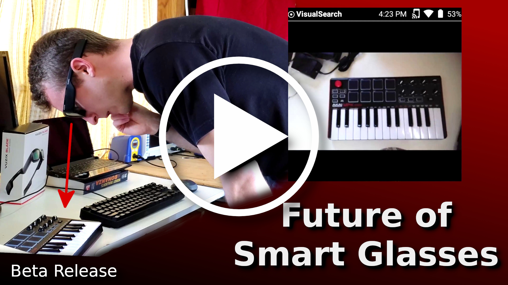

# SmartGlassesManager

The *Smart Glasses Manager* (name TBD) is an application that solves a major problem of smart glasses. Namely, we want multiple different apps to run on our phone, and all of them to display on our smart glasses. However, only 1 app can connect to the glasses at any 1 time using bluetooth, and something has to manage the UI, which app is displaying, etc. The Smart Glasses Manager is that 1 app that connects to the glasses, handles the UI, and displays information from various third party apps on your smart glasses. This has the handy side-effect that one can write 1 app, and it will work on any pair of smart glasses that the Smart Glassses Manager supports.

This project is being built by TeamOpenSmartGlasses. It was started by Cayden Pierce at Emex Labs as the WearableIntelligenceSystem (WIS). We are taking the WIS and stripping it down to fulfill only the things we discuss in this document.

## Architecture

1. Android native smart phone server (WIS fork)
2. A native Android library that third parties app call to send data to smart glasses through the ASP server
3. Android native smart glasses thin client (WIS fork)gg
4. MCU C/++ smart glasses thin client (OSSG fork)

## ASP server Features

1. Connect smart phone to smart glasses
    - likely BLE, maybe WiFi
    - Android smart glasses
    - microcontroller smart glasses
2. Receive audio from glasses
3. Transcribe audio
4. Share transcription with other apps on the same device
5. Receive data from other apps on the same device, send this data to be displayed on smart glasses
6. UI, voice command (TBD how this works with everything else)

## Fork of the Wearable Intelligence System

This repo is a fork of the [Wearable Intelligence System](https://github.com/emexlabs/WearableIntelligenceSystem). The Wearable Intelligence System was started at [Emex Labs](https://emexwearables.com) by [Cayden Pierce](https://caydenpierce.com/).

The Wearable Intelligence System (WIS) is the homepage for your smart glasses with a host of built-in apps, voice controls, always available HUD information, app launcher, and more. The WIS makes building smart glasses applications easy. There's a number of powerful and fashionable smart glasses being released (2022-24), and the WIS gives you an interface and apps to make those glasses useful. The WIS is like your phone homescreen or your computer desktop combined with a smart assistant.

### Beta Version Video

#### Early Alpha Version Video

 
## How To Use 

You will need two pieces of hardware to run the system:  

- ASP - Android Smart Phone
- ASG - Android Smart Glasses (Android or microcontroller based)

## Install / Use

### First Time Setup

1. On your Android smart phone, download the "Wearable Intelligence System" app:
    - (RECCOMENDED) Play Store: Coming soon
    - [Github latest release](https://github.com/emexlabs/WearableIntelligenceSystem/releases)
2. On your smart glasses, download the "Wearable Intelligence System" app:
    - (RECCOMENDED) Vuzix Store: Coming soon
    - [Github latest release](https://github.com/emexlabs/WearableIntelligenceSystem/releases)
3. 
    * Launch the "Wearable Intelligence System" app on your smart phone
    * Accept permissions.
    * Tap "Start Wifi Hotspot", turn on (configure password if necessary) your wifi hotspot, then go "Back" to return
4. Connect smart glasses WiFi to the smart phone WiFi hotspot
5. Enable mobile data (or wifi sharing) on Android smart phone
6. Start "Wearable Intelligence System" application on smart glasses
7. 
    * The phone connection icon will be green if the glasses are connected to your phone. If you speak, you'll see a live transcript on the smart glasses screen.
    * On the Android smart phone, got to "Memory Tools" -> "Memory Stream" and you will see live transcripts
8. Setup complete.

### Normal Use
    
Here's how to launch the system after you've already done the initial setup above:  

1. Launch "WIS" app on smart phone
2. Enable mobile hotspot on smart phone with the "Start WiFi Hotspot" button
3. Connect Android smart glasses to Android smart phone WiFi hotspot.
4. Launch "WIS" app on smart glasses.
5. Verify system is running by the "Smart Glasses Conection Indicator" icon turning white on the smart glasses HUD.
    
## Documentation / Developers
    
The docs are hosted on this repo's Wiki, [here are the docs](https://github.com/TeamOpenSmartGlasses/SmartGlassesManager/wiki).
   
## Authors

The system is fully Open Source and built by TeamOpenSmartGlasses. We're a team building open source smart glasses technology to enhance user's intelligence in daily life. Join us: https://discord.gg/5ukNvkEAqT

The TeamOpenSmartGlasses member who are contributing to this project include:

- Cayden Pierce - [Emex Labs](https://emexwearables.com)
- Alex Israelov - http://www.alexisraelov.com/
- Aaditya Vaze - https://thisisvaze.com/
- Jeremy Stairs - https://github.com/stairs1
- Add Your Name Here!

We are actively building a community that is building cognitive augmentation technologies together. 

